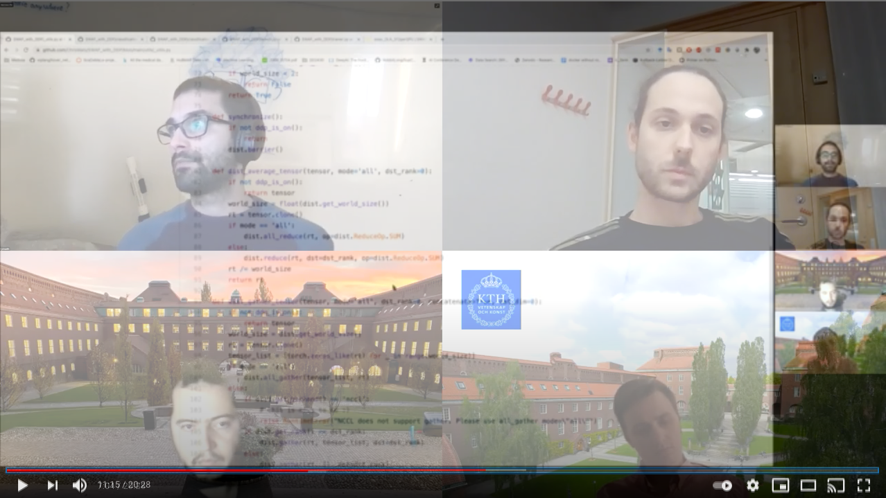

# Repo for the ScaDaMaLe project
[Stochastic Weight Averaging in Parallel (SWAP)](https://openreview.net/pdf?id=rygFWAEFwS) in [PyTorch](https://pytorch.org/)

Christos Matsoukas @ChrisMats

Emir Konuk @emirkonuk

Johan Fredin Haslum @cfredinh

Miquel Marti @miquelmarti

### Please clik on the image below to see our video

[](https://youtu.be/O3ZxNvEx48Q)

## Install dependencies etc.

- Python 3.8+ 
- Pytorch 1.7+

### Install using conda
- Using comands\
```conda create -n swap python=3.8 scikit-learn easydict matplotlib wandb tqdm -y```\
```conda install pytorch torchvision cudatoolkit=10.2 -c pytorch -y```

- Using the .yml file\
```conda env create -f environment.yml```


## Docker setup
- Note that the Dockerfile is provided for single machine, multiGPU usage. For multi-machine setups, refer to the SLURM section.
- Dockerfile has its own comments. At the end of the file there are a few lines describing how to build/run the docker image. You can (and should) modify the port numbers depending on your setup. 
- Recommended folder setup is to have _/storage_ in the host machine and _/storage_ in the docker image. Clone [this repository](https://github.com/ChrisMats/SWAP_with_DDP) to the _/storage_ in the host machine, and work from there. You can change the WORKDIR (Line 107) in the Dockerfile if you desire a different folder setup. 
- By default, the image will start with a jupyter notebook running, accessible at port 8855. If you want to login to bash directly, comment/uncomment the respective lines (109 & 111).
- Remember to add your WANDB_API_KEY to the respective line in the Dockerfile.
- You can change your image username (line 31). The default is <swapuser>.
- If you want to directly clone the repo to the image, you can just add the link and uncomment the respective line (line 103). This is not recommended as you will most likely connect to git from the host for secure access.
- If you need to set up rootless docker with nvidia GPU support, first install [rootless docker](https://docs.docker.com/engine/security/rootless/). Then, install [nvidia-docker](https://github.com/NVIDIA/nvidia-docker). After installation, remember to edit _/etc/nvidia-container-runtime/config.toml_ to have _"no-cgroups = true"_ before restarting the docker daemon.

## Distributed training using SLURM

- Before starting training, define necessary resources for each node in the ```cluster_run.sbatch``` file.
- Train on multiple nodes on SLURM cluster using comand \
``` cd your_path/SWAP_with_DDP```\
```sbatch cluster_run.sbatch your_conda_env data_location```
- (N-number of nodes)x(P-processes per node) are initiated each running ```main.py```
- All comunications between processes are handled over TCP and a master process adress is set using ```--dist_url```
- The code, conda environment and data location have to be available from all nodes with the same paths

## Usage
- All input options need to be modified in the _params.json_ file.\
``` cd your_path/SWAP_with_DDP```\
```python classification.py --params_path params.json```
- About the params, if you increase the num_worksers and notice it is slow, you should set it back to 0 or 1. This is a problem that occurs with pytorch DDP.

### Results
CIFAR10 - 8 GPUs - 512 per gpu - 150 epochs - Step 2 starts at step 1500 - without SWAP 94.3, with SWAP 95.7


## TO DO:
- [x] Basic training for CIFAR10 :heavy_check_mark:
- [x] (Optional) Finetune model and hyperparameters
- [x] Vanila DDP - Single server :heavy_check_mark:
    - [x] Basic DDP handlers and launch defs
    - [x] Device_id everywhere 
    - [x] Dataloaders
    - [x] Training loop
    - [x] Logging (vanila)    
    - [x] Evaluation (vanila)        
    - [x] Save / load

- [x] Final DDP - multiple servers :heavy_check_mark:
    - [x] work with SLURM
    - [x] work on multiple servers  
    - [x] DDP on log/eval etc     
- [x] [SWAP](https://openreview.net/pdf?id=rygFWAEFwS) :heavy_check_mark:
    - [x] model handling
    - [x] proper averaging
    - [x] dataloader handling    
    - [x] saver handling        
- [ ] Fix readme :heavy_check_mark:
    - [x] Add "how-to" with SLURM
    - [x] Add "how-to" without SLURM, i.e. on a single machine
    - [x] Describe the code, which file has what function etc or comment the code
- [x] Clean up code :heavy_check_mark:
    - [x] Comments, rebasing etc
